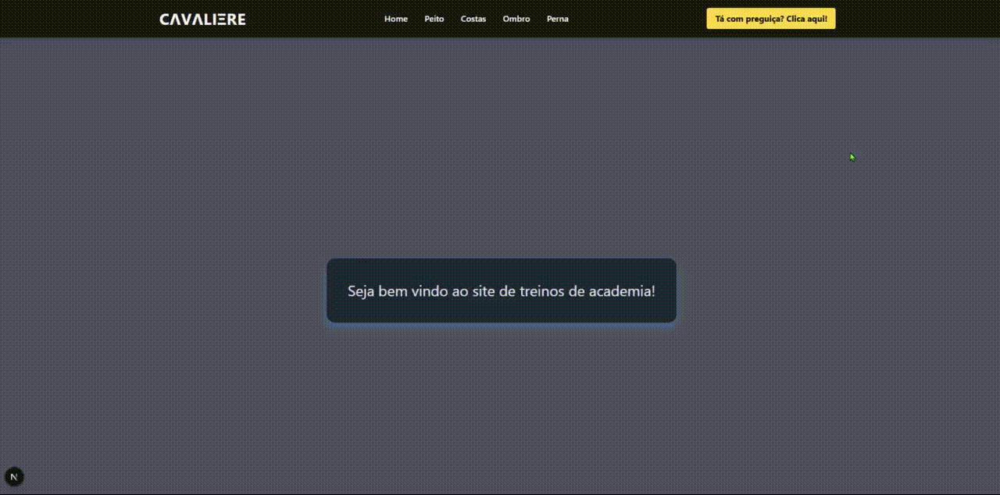

# **CΛVΛLIΞRE**

# 🏋️‍♂️ SiteAcademia - Plataforma de Treinos

Este projeto é um site de treinos desenvolvido com **Next.js**, idealizado para ajudar pessoas a organizarem seus treinos de musculação de forma simples e visual. Com ele, você encontra exercícios divididos por grupos musculares, imagens ilustrativas, descrição e uma interface divertida para motivar até os mais preguiçosos!

---

## 🚀 Tecnologias Utilizadas

- [Next.js](https://nextjs.org/) (App Router)
- React
- CSS Modules
- Tailwind CSS (opcional)
- JSON como banco de dados local
- Imagens e GIFs para visualização dos exercícios
- Link do projeto: <a href="https://gym-page-eight.vercel.app/" target="_blank" rel="noopener noreferrer">
  Acessar Projeto
</a>

